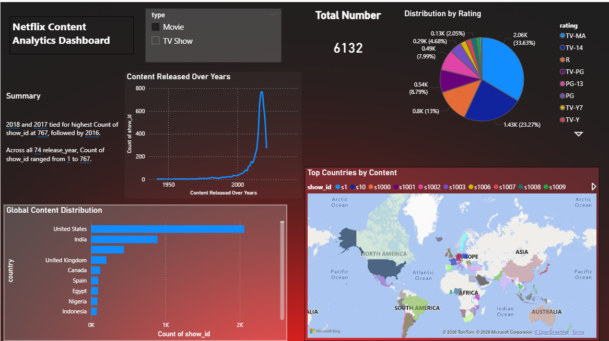

 Netflix Content Analytics Dashboard

An interactive Power BI dashboard built using Netflix dataset to analyze content trends, ratings, release patterns, and global distribution of movies and TV shows available on Netflix.

## Features

* Total content analysis (Movies vs TV Shows)
* Content distribution by ratings
* Year-wise release trend analysis
* Global content distribution by country
* Interactive filters and visuals
* Geographical content mapping using world map visualization

## Tools & Technologies

* Power BI
* Data Visualization
* Data Cleaning
* DAX
* Microsoft Bing Maps

## Key Insights

* 2017 and 2018 recorded the highest content releases.
* TV-MA and TV-14 are the most common content ratings.
* United States contributes the highest amount of Netflix content.
* Significant growth in Netflix content additions observed after 2015.

## Dataset

The dataset contains information about Netflix movies and TV shows including:

* Title
* Country
* Director
* Rating
* Release Year
* Duration
* Category Type

## Project Objective

To perform exploratory data analysis and create an interactive dashboard that provides meaningful insights into Netflix’s global content library.

## Dashboard Preview

## Author

Purva Mohature
